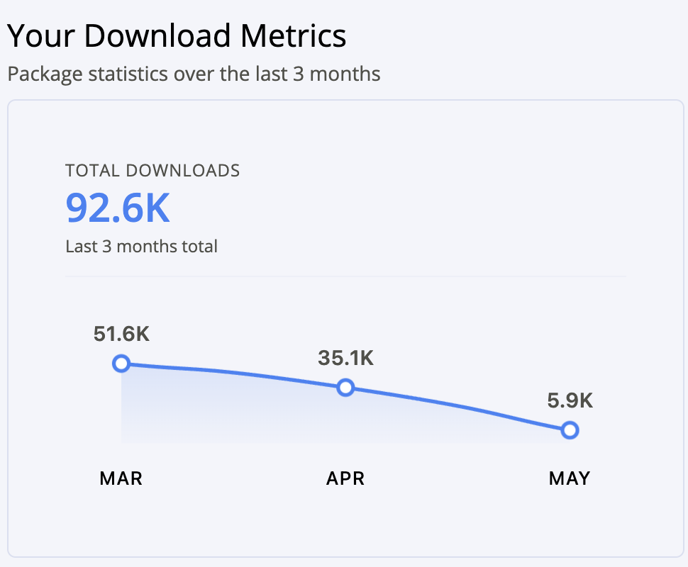

# Hi, I'm Ranbir 👋

📍 **Earth** | 🧑‍💻 **Kotlin Multiplatform & Compose enthusiast** | 🚀 **Open Source Builder**

> Building cross-platform SDKs, developer tools, and CLI apps. I ship libraries that make other developers' lives easier — type-safe, coroutine-first, no compromises.

## Current Projects

### KMP SDKs & Backend Integrations

- ⚡ **[supabase-kmp](https://github.com/AndroidPoet/supabase-kmp)** — Kotlin Multiplatform SDK for Supabase
- 🧰 **[pocketbase-kmp](https://github.com/AndroidPoet/pocketbase-kmp)** — Kotlin Multiplatform SDK for PocketBase
- ☁️ **[cloudflare-kmp](https://github.com/AndroidPoet/cloudflare-kmp)** — KMP SDK and Worker gateway for Cloudflare D1, KV, R2, and realtime apps
- 🧠 **[openai-kmp](https://github.com/AndroidPoet/openai-kmp)** — Kotlin Multiplatform SDK for OpenAI APIs
- 📊 **[posthog-kmp](https://github.com/AndroidPoet/posthog-kmp)** — type-safe analytics, feature flags, and session replay for PostHog
- 🔗 **[convex-kmp](https://github.com/AndroidPoet/convex-kmp)** — coroutine-first Kotlin Multiplatform SDK for Convex
- 🏰 **[appwrite-kmp](https://github.com/AndroidPoet/appwrite-kmp)** — modular Kotlin Multiplatform SDK for Appwrite
- 💰 **[superwall-kmp](https://github.com/AndroidPoet/superwall-kmp)** — remote paywall configuration, A/B testing, and subscription management
- 💳 **[dodopayments-kmp](https://github.com/AndroidPoet/dodopayments-kmp)** — Kotlin Multiplatform SDK for Dodo Payments
- 🚀 **[KtorBoost](https://github.com/AndroidPoet/KtorBoost)** — Ktor client helpers for KMM and Compose Multiplatform

### Compose Libraries & Android

- 💧 **[Dropdown](https://github.com/AndroidPoet/Dropdown)** — customizable Compose Multiplatform dropdown menus with cascade animations
- 🌌 **[nebula](https://github.com/AndroidPoet/nebula)** — server-driven native UI for Kotlin Multiplatform, JSON to Compose without WebView
- 📊 **[Drafter](https://github.com/AndroidPoet/Drafter)** — charting library for Compose Multiplatform applications
- 🌍 **[CountryPicker](https://github.com/AndroidPoet/CountryPicker)** — customizable country picker for Compose Multiplatform
- 🍞 **[DhyanToast](https://github.com/AndroidPoet/DhyanToast)** — Compose Multiplatform toast notifications with gestures, animations, and theming
- 🛡️ **[compose-guard](https://github.com/AndroidPoet/compose-guard)** — Android Studio plugin for Jetpack Compose best-practice detection
- 💠 **[Metaphor](https://github.com/AndroidPoet/Metaphor)** — Android Material motion system animations
- ☯️ **[Material-Intro](https://github.com/AndroidPoet/Material-Intro)** — app intro flow with Material Motion animations
- 📓 **[Material-Notes](https://github.com/AndroidPoet/Material-Notes)** — MVVM notes app with Hilt, Room, Flow, and Material Motion
- 🧱 **[Clean-Architecture](https://github.com/AndroidPoet/Clean-Architecture)** — Kotlin Android clean architecture sample
- 💎 **[LiquidKit](https://github.com/AndroidPoet/LiquidKit)** — Kotlin project for modern UI experiments

### CLI Tools & Release Ops

- 🎮 **[playconsole-cli](https://github.com/AndroidPoet/playconsole-cli)** — fast, lightweight, scriptable CLI for Google Play Console
- 💳 **[revenuecat-cli](https://github.com/AndroidPoet/revenuecat-cli)** — fast, scriptable CLI for RevenueCat
- 📦 **[appwrite-cli](https://github.com/AndroidPoet/appwrite-cli)** — single-binary Appwrite CLI with profiles, formats, and environments
- 🚢 **[shipkit](https://github.com/AndroidPoet/shipkit)** — AI-agent-friendly release cockpit for mobile apps
- ✅ **[cu-cli](https://github.com/AndroidPoet/cu-cli)** — command-line interface for ClickUp tasks, lists, and workspaces
- 🍺 **[homebrew-tap](https://github.com/AndroidPoet/homebrew-tap)** — Homebrew formulae for AndroidPoet tools

### AI, Docs & Agent Tooling

- 🧠 **[greymatter](https://github.com/AndroidPoet/greymatter)** — human-like memory for AI CLIs
- 🧩 **[openmemory](https://github.com/AndroidPoet/openmemory)** — local memory layer for Claude, ChatGPT, Cursor, and other AI tools
- 🐍 **[krait](https://github.com/AndroidPoet/krait)** — security testing for AI agents
- 📚 **[rndocs](https://github.com/AndroidPoet/rndocs)** — React Native docs as an offline CLI and MCP server
- 🪶 **[fldocs](https://github.com/AndroidPoet/fldocs)** — Flutter and Jetpack Compose docs as an offline CLI and MCP server
- 🧱 **[fldocs-compose](https://github.com/AndroidPoet/fldocs-compose)** — Jetpack Compose docs as an offline CLI and MCP server
- 🦋 **[fldocs-flutter](https://github.com/AndroidPoet/fldocs-flutter)** — Flutter docs as an offline CLI and MCP server
- 🤖 **[playconsole-cli-skills](https://github.com/AndroidPoet/playconsole-cli-skills)** — agent skills for the Play Console CLI
- 🤖 **[revenuecat-cli-skills](https://github.com/AndroidPoet/revenuecat-cli-skills)** — agent skills for the RevenueCat CLI

## GitHub Activity

## Library Download Metrics

## What I'm Doing

- **Building KMP SDKs** — Wrapping backend platforms (Supabase, PostHog, Convex, Appwrite, Superwall) into clean, type-safe Kotlin Multiplatform libraries
- **Shipping CLI tools** — Fast Go binaries for developer workflows — Play Console, RevenueCat, Appwrite
- **Compose everything** — Pushing Compose Multiplatform to every platform it can reach
- **AI-native development** — Using Claude Code and agentic workflows to ship at ludicrous speed

## Connect

---

### Recognition

- Featured in **[Google Dev Library](https://devlibrary.withgoogle.com/authors/AndroidPoet)**
- 1k+ GitHub stars across projects
- Published on Maven Central — SDKs used across Android, iOS, Desktop, WasmJs

### Philosophy

> "Ship libraries that make other developers' lives easier. Type-safe, coroutine-first, no magic — just clean Kotlin."

Random Facts

- Run multiple Claude Code instances in parallel
- Believe every backend API deserves a KMP SDK
- Go for CLI tools, Kotlin for everything else
- Compose Multiplatform maximalist

